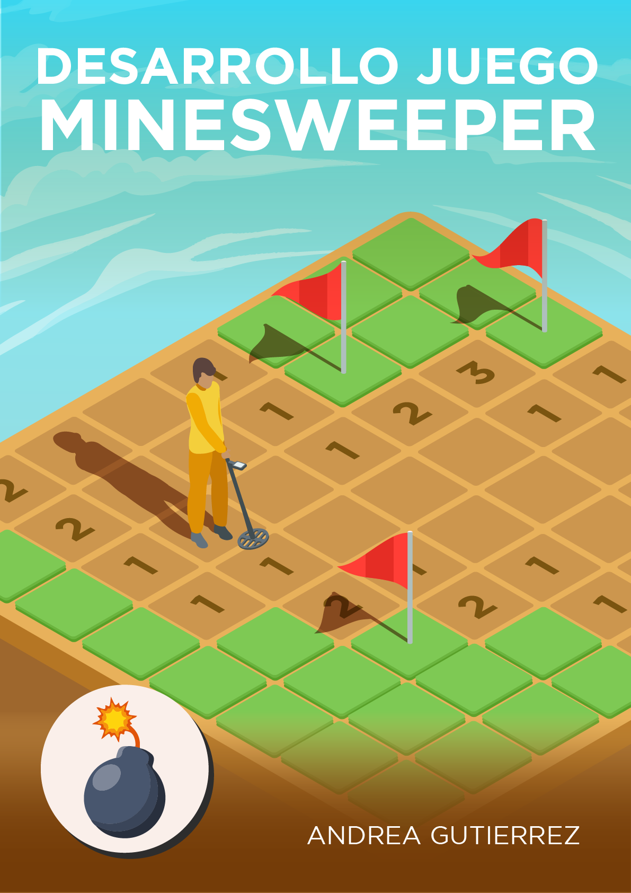
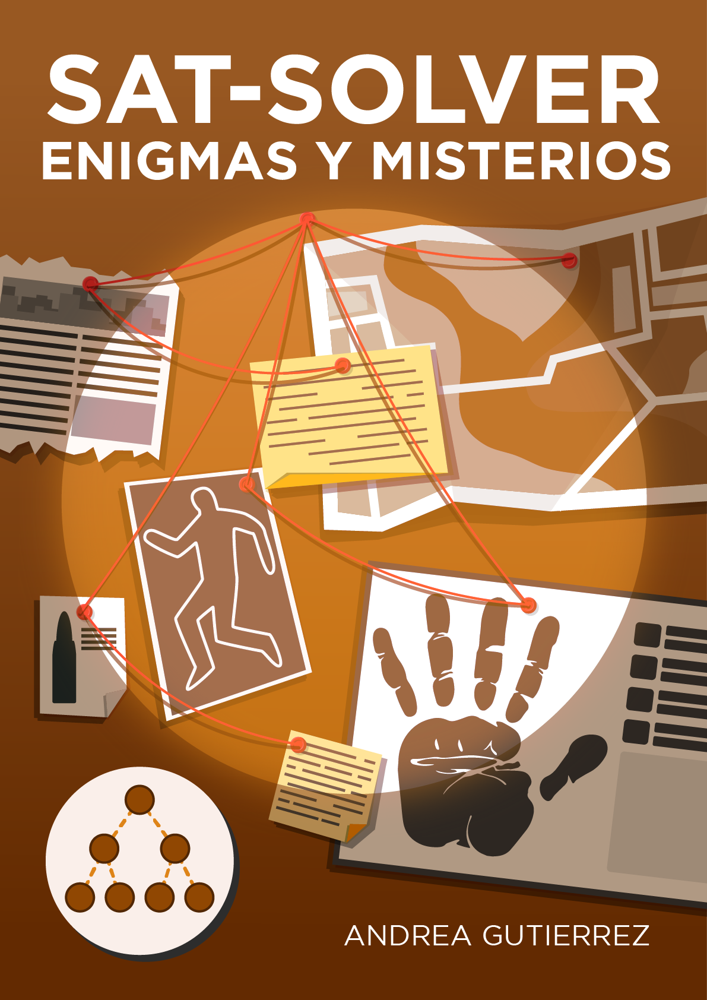

<h1 align="center">Hello, Andrea Gutierrez</h1>

  

I am a Systems Engineer and Software Engineering student.  
You can contact me at: [ing.andreagutierrezblanco@gmail.com](mailto:ing.andreagutierrezblanco@gmail.com)

## About Me

I am passionate about technology, programming, and developing innovative solutions.  
This profile contains information about my skills, projects, and technology stack.

## Skills & Technology Stack

### Languages

### Frameworks & Libraries

### Databases

### Testing & QA

### DevOps & Cloud

### IDEs & Development Tools

### Version Control & Collaboration

### Operating Systems

### Design & Creative Tools

### Data Science & AI/ML

### Build Tools & Package Managers

### Other Tools & Technologies

## GitHub Analytics

  
  
   
  

# Projects

## Selected Projects

<table align="left">
  <tr border="none">
    <td width="25%" align="center">
      

        
      

      

        
      

    </td>
    <td width="25%" align="center">
      

        
      

      

        
      

    </td>
    <td width="25%" align="center">
      

        
      

      

        
      

    </td>
    <td width="25%" align="center">
      

        
      

      

        
      

    </td>
  </tr>
  
  <tr border="none">
    <td width="25%" align="center">
      

        
      

      

        
      

    </td>
    <td width="25%" align="center">
      

        
      

      

        
      

    </td>
    <td width="25%" align="center">
      

        
      

      

        
      

    </td>
    <td width="25%" align="center">
      

        
      

      

        
      

    </td>
  </tr>
  
  <tr border="none">
    <td width="25%" align="center">
      

        
      

      

        
      

    </td>
    <td width="25%" align="center">
      

        
      

      

        
      

    </td>
    <td width="25%" align="center">
      

        
      

      

        
      

    </td>
    <td width="25%" align="center">
      

        
      

      

        
      

    </td>
  </tr>
  
  <tr border="none">
    <td width="25%" align="center">
      

        
      

      

        
      

    </td>
    <td width="25%" align="center">
      

        
      

      

        
      

    </td>
    <td width="25%" align="center">
      

        
      

      

        
      

    </td>
    <td width="25%" align="center">
      

        
      

      

        
      

    </td>
  </tr>
  
  <tr border="none">
    <td width="25%" align="center">
      

        
      

      

        
      

    </td>
    <td width="25%" align="center">
      

        
      

      

        
      

    </td>
    <td width="25%" align="center">
    </td>
    <td width="25%" align="center">
    </td>
  </tr>
</table>

## Contact

  
  
  

